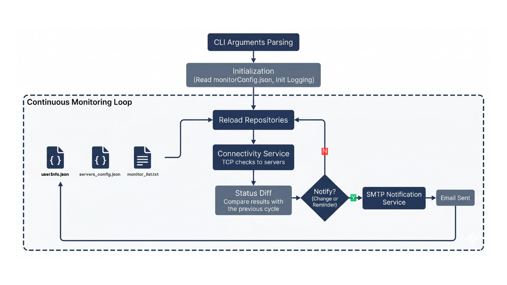

**server-availability-monitor (SAM)** é uma ferramenta de linha de comando que monitora a disponibilidade de servidores e envia notificações por e-mail quando detecta quedas, recuperações ou servidores persistentemente offline.


## 🔄 Execução

O SAM opera em loop contínuo. A cada ciclo, a sequência abaixo é executada:

<div align="center">
  
  <p><sub>FLUXO DE FUNCIONAMENTO</sub></p>
</div>

1. **Argumentos da CLI parseados**
2. **Inicialização** — `monitor_config.json` lido e validado; logging inicializado
3. **Loop** — a cada `timing.check_interval_in_seconds`:
   - **Repositórios** — arquivos de configuração relidos do disco
   - **Serviço de conectividade** — servidores da lista verificados via TCP em paralelo (`concurrency.check_workers` threads)
   - **Diff de status** — resultado comparado ao ciclo anterior
   - **Serviço de notificação** — e-mail enviado via SMTP (com timeout) se houver queda, recuperação ou lembrete vencido

O intervalo entre ciclos, o timeout de conexão, o intervalo mínimo entre notificações e o número de threads de verificação são configuráveis em `monitor_config.json`. Os limites mínimo e máximo de cada um desses campos são validados pelos DTOs no bootstrap — valores fora da faixa interrompem a inicialização.

## 🛠️ Instalação e Execução

Desenvolvido em **Python 3.9**, recomenda-se o uso dessa versão para garantir compatibilidade. O projeto não possui dependências externas — apenas a biblioteca padrão do Python é utilizada.

### 1️⃣ Criar e Ativar o Ambiente Virtual

```bash
# Windows
python -m venv .venv
.venv\Scripts\activate

# Linux / macOS
python3 -m venv .venv
source .venv/bin/activate
```

### 2️⃣ Preencher os Arquivos de Configuração

O SAM depende de quatro arquivos para operar. Os caminhos de todos eles são configuráveis; os valores abaixo servem como referência para o preenchimento.

---

#### `monitor_config.json`

Configuração central da aplicação. Referenciado via `-c/--config` (o padrão é: `monitor_config.json`).

```json
{
  "smtp": {
    "host": "smtp.gmail.com",
    "port": 587,
    "username": "seu-email@gmail.com",
    "password": "sua-senha-de-app",
    "use_tls": true,
    "from_address": "seu-email@gmail.com"
  },
  "timing": {
    "check_interval_in_seconds": 15,
    "check_timeout_in_seconds": 3,
    "notification_interval_in_seconds": 60
  },
  "concurrency": {
    "check_workers": 10
  },
  "paths": {
    "servers_config_file": "servers_pool.json",
    "user_info_file": "users_info.json",
    "logs_folder": "logs"
  }
}
```

| Campo                                     | Descrição                                              |
| ----------------------------------------- | ------------------------------------------------------ |
| `smtp.host`                               | Endereço do servidor SMTP                              |
| `smtp.port`                               | Porta do servidor SMTP                                 |
| `smtp.username`                           | Usuário de autenticação SMTP                           |
| `smtp.password`                           | Senha ou app password                                  |
| `smtp.use_tls`                            | Habilita STARTTLS                                      |
| `smtp.from_address`                       | Endereço do remetente                                  |
| `timing.check_interval_in_seconds`        | Intervalo entre ciclos de verificação                  |
| `timing.check_timeout_in_seconds`         | Timeout de cada conexão TCP                            |
| `timing.notification_interval_in_seconds` | Intervalo mínimo entre lembretes de servidores offline |
| `concurrency.check_workers`               | Nº de threads para verificação paralela dos servidores |
| `paths.servers_config_file`               | Caminho para o arquivo de servidores monitorados       |
| `paths.user_info_file`                    | Caminho para o arquivo de destinatários                |
| `paths.logs_folder`                       | Pasta onde os logs serão gravados                      |

---

#### `servers_pool.json`

Lista de servidores que podem ser monitorados. Referenciado via `paths.servers_config_file`.

```json
[
  { "hostname": "google-dns", "ip": "8.8.8.8", "port": 53 },
  { "hostname": "cloudflare", "dns": "one.one.one.one", "port": 443 },
  { "hostname": "meu-servidor", "dns": "meuservidor.com", "port": 443 }
]
```

Cada entrada deve conter `hostname`, `port` e um dos dois campos de endereço: `ip` ou `dns`.

---

#### `users_info.json`

Lista de destinatários que receberão as notificações por e-mail. Referenciado via `paths.user_info_file`.

```json
[{ "username": "Nome Sobrenome", "email": "destinatario@email.com" }]
```

#### `monitor_list.txt`

Define quais hostnames de `servers_pool.json` estão ativamente sob monitoramento. Referenciado via `-l/--list` (o padrão é: `monitor_list.txt`). Um hostname por linha.

```
google-dns
cloudflare
meu-servidor
```

Servidores presentes em `servers_pool.json` mas ausentes desta lista são ignorados pelo monitor. Já hostnames listados aqui mas **não cadastrados** em `servers_pool.json` são ignorados e registrados como `WARNING` a cada ciclo — sem interromper a execução.

---

### 3️⃣ Iniciar o Monitor

```bash
python -m app
```

Por padrão, o SAM busca `monitor_config.json` e `monitor_list.txt` no diretório de trabalho atual. Os caminhos podem ser sobrescritos via argumentos:

```
usage: app [-h] [-l MONITOR_LIST_FILE] [-c MONITOR_CONFIG_FILE]

optional arguments:
  -h, --help                            Exibe esta mensagem e encerra
  -l, --list    MONITOR_LIST_FILE       Arquivo com a lista de hostnames monitorados
                                        (default: monitor_list.txt)
  -c, --config  MONITOR_CONFIG_FILE     Arquivo de configuração do monitor
                                        (default: monitor_config.json)
```

Exemplo com caminhos explícitos:

```bash
python -m app -l /etc/sam/monitor_list.txt -c /etc/sam/monitor_config.json
```

Os logs são gravados em `paths.logs_folder` com rotação diária (um arquivo por data). Para encerrar a execução, pressione `CTRL+C`.

## 🧪 Cobertura de Testes

A suíte cobre apenas a **lógica pura** da aplicação — validação dos DTOs (`TimingConfig`, `ConcurrencyConfig`), o diff de status entre ciclos (`_diff_statuses`) e a regra de lembrete (`_is_reminder_due`), seguindo o padrão _arrange / act / assert_.

O `pytest` é a única dependência de desenvolvimento (declarada em `requirements.txt`). Para executar:

```bash
pip install -r requirements.txt
pytest --verbose
```

## 🗂️ Estruturação

```
server-availability-monitor/
├── app/
│   ├── dtos/
│   │   ├── __init__.py
│   │   ├── _base.py
│   │   ├── monitor_config.py
│   │   ├── servers_pool.py
│   │   └── users_info.py
│   ├── repositories/
│   │   ├── __init__.py
│   │   ├── monitor_config_repository.py
│   │   ├── monitor_list_repository.py
│   │   ├── servers_config_repository.py
│   │   └── user_info_repository.py
│   ├── services/
│   │   ├── __init__.py
│   │   ├── connectivity_service.py
│   │   ├── email_service.py
│   │   ├── file_system_service.py
│   │   ├── log_service.py
│   │   └── notification_service.py
│   ├── __main__.py
│   └── enums.py
├── assets/
├── logs/
├── monitor_config.json
├── monitor_list.txt
├── servers_pool.json
└── users_info.json
```

### 📁 `app/`

Código-fonte da aplicação.

#### 📄 `__main__.py`

Ponto de entrada. Faz o parse dos argumentos de CLI, inicializa o monitor e conduz o loop principal de monitoramento, coordenando o recarregamento de configurações, a verificação de servidores e o envio de notificações a cada ciclo.

#### 📁 `dtos/`

Objetos de transferência de dados que representam as estruturas lidas dos arquivos de configuração — `MonitorConfig`, `ServersPool` e `UsersInfo`. Cada DTO é imutável (`frozen=True`) e expõe um método `validate()` que verifica a integridade dos seus campos. O módulo `_base.py` define a classe base compartilhada por todos os DTOs.

#### 📄 `enums.py`

Enumerações da aplicação. Define `ServerStatus` (`ONLINE` / `OFFLINE`), utilizado para classificar o resultado de cada verificação de conectividade.

#### 📁 `repositories/`

Camada de acesso a dados. Cada repositório é responsável por ler e manter em memória um dos arquivos de configuração. Os repositórios são recarregados do disco a cada ciclo, permitindo que alterações nos arquivos entrem em vigor sem reiniciar o monitor.

| Módulo                         | Responsabilidade                                     |
| ------------------------------ | ---------------------------------------------------- |
| `monitor_config_repository.py` | Lê e valida o `monitor_config.json`                  |
| `monitor_list_repository.py`   | Lê a lista de hostnames ativos do `monitor_list.txt` |
| `servers_config_repository.py` | Lê e indexa os servidores do `servers_pool.json`     |
| `user_info_repository.py`      | Lê os destinatários do `users_info.json`             |

#### 📁 `services/`

Camada de serviços com lógica de negócio e I/O.

| Módulo                    | Responsabilidade                                                |
| ------------------------- | --------------------------------------------------------------- |
| `connectivity_service.py` | Verifica a disponibilidade de um servidor via conexão TCP       |
| `email_service.py`        | Envia e-mails via SMTP                                          |
| `file_system_service.py`  | Leitura de arquivos JSON e texto; resolução de caminhos         |
| `log_service.py`          | Configura e expõe o logger da aplicação                         |
| `notification_service.py` | Compõe e despacha notificações de queda, recuperação e lembrete |

### 📁 `assets/`

Ativos do projeto materializados como arquivos estáticos.

### 📁 `logs/`

Logs gerados em tempo de execução, com rotação diária. O arquivo ativo é nomeado `sam.log` e os arquivos rotacionados recebem a data correspondente (ex: `sam.2026-05-26.log`).

## 📚 Referências

- Desafio técnico que originou este projeto, disponível em:
  - [`assets/technical-challenge.md`](./assets/technical-challenge.md)
  - [`assets/technical-challenge.pdf`](./assets/technical-challenge.pdf)
